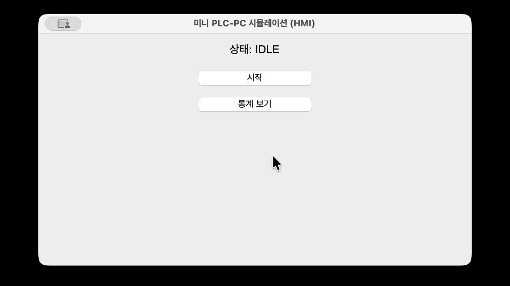

# 미니 PLC-PC SCADA 시뮬레이션

PLC 하드웨어 없이, 파이썬만으로 "PLC 제어 + PC 화면 + 데이터 기록 + 통계"라는
SCADA 시스템의 핵심 동작을 축소 재현한 교육용 프로젝트입니다.
처음 파이썬을 써보는 사람도 그대로 따라 하면 실행할 수 있도록 작성했습니다.

**🔴 [라이브 데모 보기](https://jaekwan-coder.github.io/mini-plc-scada-sim/)** — 다운로드나 설치 없이,
브라우저에서 바로 컨베이어/센서/실린더 동작을 눈으로 볼 수 있습니다. (`index.html`,
GitHub Pages로 호스팅. 켜는 방법은 아래 9-2번 "라이브 데모 켜기" 항목 참고)


*(위 줄은 화면 녹화 GIF를 만들어서 `demo.gif`로 저장해두면 자동으로 재생됩니다 — 아래 9번 항목 참고)*

---

## 1. 이 프로젝트로 무엇을 볼 수 있나

두 가지 버전이 들어있습니다.

1. **기본 버전** (`main.py`) — 화면 하나에서 버튼을 누르면 바로 로직이 돌고 결과가 보이는 가장 단순한 형태
2. **통신 버전** (`plc_server.py` + `pc_client.py`) — "PLC 역할을 하는 프로그램"과 "PC 화면 역할을 하는 프로그램"을 완전히 분리해서, 소켓(네트워크 통신)으로 서로 대화하게 만든 형태

실무의 PLC-PC 연동에서 "통신 케이블로 명령을 주고받는다"는 게 실제로 어떤 느낌인지
2번 버전에서 직접 체험할 수 있습니다.

---

## 2. 준비물

- **Python 3.9 이상** (python.org에서 설치, 설치 시 'Add Python to PATH' 체크 필수)
- 그 외 설치할 것 없음. 이 프로젝트가 쓰는 `tkinter`, `csv`, `socket`, `threading`은
  전부 파이썬에 기본으로 들어있습니다.

설치 확인 방법: 터미널(윈도우는 cmd/PowerShell, Mac은 터미널 앱)을 열고 아래 입력.

```
python --version
```

버전 숫자가 뜨면 준비 완료입니다.

---

## 3. 폴더 구성

이 프로젝트 폴더(`plc_project`) 안에 아래 파일들이 있어야 합니다.

```
plc_project/
├── main.py          <- 기본 버전 실행 파일 (이것부터 실행)
├── plc_logic.py      <- PLC 로직 (상태머신)
├── gui.py            <- 화면 (기본 버전용)
├── logger.py         <- 기록 저장 (csv)
├── stats.py          <- 통계 계산
├── plc_server.py     <- 통신 버전 - 서버
├── pc_client.py       <- 통신 버전 - 클라이언트
└── README.md          <- 이 파일
```

파일을 다른 곳으로 옮기지 말고, 이 폴더 안에 전부 같이 두세요.
서로 `import`로 연결되어 있어서 같은 폴더에 있어야 정상 동작합니다.

---

## 4. 기본 버전 실행하기 (제일 먼저 해볼 것)

1. 터미널을 열고 `cd` 명령으로 `plc_project` 폴더로 이동합니다.
   ```
   cd 바탕화면/plc_project
   ```
2. 아래 명령으로 실행합니다.
   ```
   python main.py
   ```
3. 작은 창이 하나 뜹니다. 다음을 확인하세요.
   - "상태: IDLE" 이라고 쓰여 있는 글자
   - "시작" 버튼
   - "통계 보기" 버튼

### 동작 확인 순서

1. **시작** 버튼을 누른다 → 버튼 글자가 "정지"로 바뀌고, 1초마다 상태 글자가
   `IDLE → MOVING → DETECTED → STOPPED → PUSHING → RETURNING → IDLE` 순서로 바뀐다.
2. 몇 번 순환하는 걸 지켜본다.
3. **정지** 버튼(원래 "시작" 버튼이었던 자리)을 누른다 → 상태 변화가 멈춘다.
4. **통계 보기** 버튼을 누른다 → 지금까지 몇 사이클 돌았는지, 어떤 상태에
   가장 오래 머물렀는지가 화면에 표시된다.
5. 프로젝트 폴더 안에 `log.csv` 파일이 새로 생긴 걸 확인한다 (엑셀로 열어볼 수 있음).

### 예상 출력 예시 (통계 보기 눌렀을 때)

```
총 스캔 기록: 18건
완료된 사이클 수: 3회
가장 많이 거친 상태: IDLE (3회)
```

---

## 5. 통신 버전 실행하기 (PLC와 PC를 진짜로 분리해서 대화시키기)

이번엔 터미널 창을 **두 개** 열어야 합니다.

### 터미널 창 1 — PLC 서버 실행

```
cd 바탕화면/plc_project
python plc_server.py
```

아래처럼 뜨면 정상입니다. 이 창은 계속 켜둔 채로 두세요.

```
=== PLC 서버 시작됨 (127.0.0.1:5000) - 클라이언트 접속 대기 중... (Ctrl+C로 종료) ===
```

### 터미널 창 2 — PC 클라이언트 실행

새 터미널 창을 하나 더 열고:

```
cd 바탕화면/plc_project
python pc_client.py
```

작은 창이 뜹니다. **시작** 버튼을 누르면:

- 창 2(클라이언트)가 창 1(서버)에게 `START`라는 명령을 네트워크로 보낸다
- 창 1(서버)의 터미널 화면에 `[요청 수신] ... -> START`가 찍힌다
- 창 1이 그때부터 실제로 상태를 바꾸기 시작한다
- 창 2는 1초마다 창 1에게 "지금 상태 뭐야?(STATUS)"라고 물어보고, 그 답을 화면에 표시한다

**이게 실제로 두 개의 독립된 프로그램이 네트워크로 대화하는 모습입니다.**
창 1을 끄고 창 2에서 버튼을 눌러보면 "서버에 연결할 수 없습니다"라는 메시지가
뜨는 것도 확인해보세요 — 실제 통신이 끊겼을 때와 똑같은 상황입니다.

---

## 6. 자주 만나는 오류와 해결법

| 오류 메시지 | 원인 | 해결 |
|---|---|---|
| `'python'은 내부 또는 외부 명령... 아닙니다` | Python이 설치 안 됐거나 PATH 설정 안 됨 | Python 재설치 시 'Add Python to PATH' 체크 |
| `ModuleNotFoundError: No module named 'plc_logic'` | 다른 폴더에서 실행함 | `cd`로 반드시 `plc_project` 폴더 안에서 실행 |
| `ConnectionRefusedError` / "서버에 연결할 수 없습니다" | `plc_server.py`를 안 켜뒀거나 먼저 안 켰음 | 서버(터미널 창 1)를 먼저 실행하고 나서 클라이언트 실행 |
| `OSError: [Errno 48] Address already in use` | 이전에 실행한 서버가 아직 포트를 쓰고 있음 | 기존 서버 창을 완전히 종료(Ctrl+C)하고 다시 실행 |

---

## 7. 다음 단계 (선택)

- **배포**: `pip install pyinstaller` 후 `pyinstaller --onefile main.py`를 실행하면,
  파이썬이 설치 안 된 컴퓨터에서도 더블클릭만으로 실행되는 파일이 `dist` 폴더에 생성됩니다.
- **GitHub 업로드**: 이 폴더 전체를 GitHub 저장소로 만들어 올리면 포트폴리오로 활용할 수 있습니다.

---

## 8. 이 프로젝트가 실제 산업 현장과 어떻게 대응되는지

| 이 프로젝트 | 실제 산업 현장 |
|---|---|
| `plc_logic.py` | PLC 안의 래더 로직 |
| `gui.py` / `pc_client.py` | HMI (사람이 조작하는 화면) |
| `logger.py` + `log.csv` | 데이터 로깅 / Historian |
| `stats.py` | 트렌드 분석 / 리포트 |
| `plc_server.py` ↔ `pc_client.py` 간 소켓 통신 | PLC-PC 간 Modbus 등 통신 프로토콜 |

전체를 합치면 "SCADA(Supervisory Control And Data Acquisition) 시스템"의
가장 작은 뼈대를 그대로 재현한 것입니다.

---

## 9. 데모 만들기 (다운로드 없이 남에게 보여주는 방법)

방문자가 코드를 직접 받아 실행하지 않아도 결과물을 볼 수 있도록 두 가지를 준비해뒀습니다.

### 9-1. GIF 데모 (기본 tkinter 버전 화면 녹화)

1. Windows는 ScreenToGif(무료), Mac은 Kap 또는 기본 화면 기록(Shift+Cmd+5)으로
   `python main.py` 실행 장면을 10~15초 정도 녹화합니다.
2. GIF로 내보내서 `demo.gif`라는 이름으로 이 폴더(`plc_project`) 안에 저장합니다.
3. 이미 이 README 맨 위에 `` 줄이 있으니, 파일만 넣으면 GitHub이 자동으로
   움직이는 GIF를 저장소 페이지에 보여줍니다.

### 9-2. 라이브 데모 (브라우저에서 바로 보이는 버전, GitHub Pages)

`index.html`은 `plc_logic.py`의 상태머신 로직을 웹 애니메이션으로 그대로 옮겨놓은
독립 실행형 페이지입니다. 저장소 **루트(맨 바깥 폴더)** 에 이 파일이 있으면,
GitHub에 올리고 아래처럼 켜기만 하면 됩니다.

1. 이 프로젝트 전체를 GitHub 저장소로 올립니다 (`index.html`이 다른 `.py` 파일들과
   같은 위치, 즉 저장소 맨 바깥에 있으면 됩니다 — 별도로 `docs` 폴더를 만들 필요 없음).
2. 저장소 페이지에서 **Settings → Pages**로 들어갑니다.
3. "Branch" 항목에서 `main` 브랜치, 폴더는 **`/ (root)`** 를 선택하고 저장합니다.
   (`/docs`가 아니라 `/ (root)`를 고르는 게 지금 파일 위치에 맞습니다.)
4. 1~2분 기다리면 `https://jaekwan-coder.github.io/mini-plc-scada-sim/` 주소가 활성화됩니다.

> 참고: 만약 나중에 `index.html`을 `docs` 폴더 안으로 옮기고 싶다면, 3번에서
> `/docs`를 선택하면 됩니다 — 둘 다 되고, 지금처럼 루트에 두는 쪽이 더 간단합니다.

이렇게 해두면 GitHub 방문자는 클론도, 파이썬 설치도 없이 링크 클릭 한 번으로
이 프로젝트가 실제로 어떻게 동작하는지 눈으로 바로 확인할 수 있습니다.